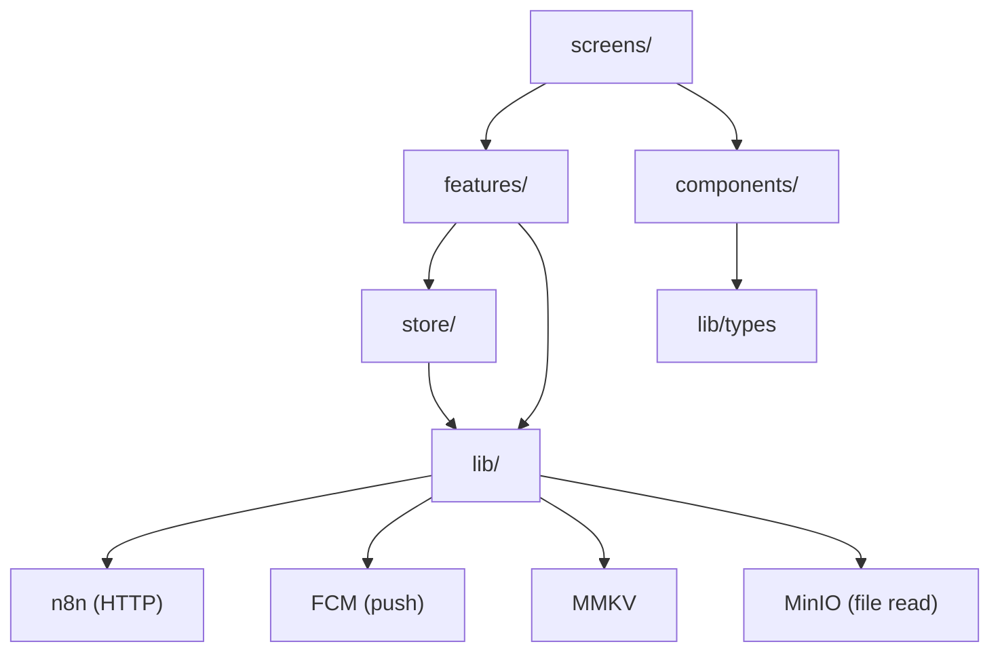
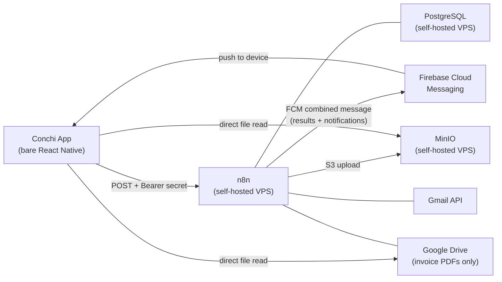

# Architecture Spine — Conchi App

## Design Paradigm

**Feature-sliced with atomic presentation.** Each feature is a vertical slice owning its domain end-to-end: Zustand state slice, business logic hooks, and n8n data access. Components are a horizontal atomic library (atoms → molecules → organisms) that features compose but never influence — `components/` has no dependency on `features/` or `store/`. Screens are thin orchestrators: they wire features to components and handle navigation. `lib/` is the shared data-access floor: the n8n HTTP client, the FCM message handler, the MMKV storage wrapper, and shared TypeScript types.

**Single backend principle:** the app never contacts PostgreSQL directly. Every data operation routes through n8n via HTTP or FCM.

Dependency direction (enforced, not convention):



## Invariants & Rules

### AD-1 — Bare React Native; pnpm as sole package manager

- **Binds:** all
- **Prevents:** Expo managed workflow blocking native widget extension targets; npm/yarn scripts diverging from pnpm lockfile
- **Rule:** project is bare React Native — no Expo managed workflow, no EAS Build. Expo SDK packages (`expo-notifications`, `expo-camera`, `expo-file-system`, `expo-secure-store`) are used as libraries only. `pnpm` is the sole package manager; `npm` and `yarn` are prohibited in scripts, CI, and documentation.

### AD-2 — Feature-sliced business logic; atomic presentational components

- **Binds:** all source files under `src/`
- **Prevents:** components accumulating store or API coupling; store becoming a global dumping ground; screens containing business logic
- **Rule:** `components/` never imports from `features/` or `store/`. Any component requiring store or API access gets a companion hook co-located in its feature folder. Zustand slices live inside their feature folder (e.g. `features/entry/entryStore.ts`); `store/index.ts` aggregates and re-exports only. Screens import from both `features/` and `components/`; they contain no business logic.

### AD-3 — FCM combined message as the unified async channel; typed event emitter dispatch

- **Binds:** entry submission (FR-1–FR-4), confirmation (FR-5–FR-6), invoice notifications (FR-21–FR-23)
- **Prevents:** SSE relay infrastructure; separate result-delivery and notification systems; polling; `lib/fcm/` importing from `features/` (which would violate AD-2)
- **Rule:** n8n sends a single FCM combined message (notification + data payload) for every async event. `data.type` discriminates: `round_trip_result` | `invoice_unknown` | `invoice_known`. App foreground: `onMessage` handler fires → system notification suppressed, event emitted. App backgrounded/closed: FCM renders the notification; tap deep-links to the correct card via React Navigation. `expo-notifications` abstracts FCM/APNs. On app startup the app POSTs its FCM device token to a dedicated n8n registration endpoint; n8n upserts it to `device_tokens` in PostgreSQL.

  **Dispatch bridge:** `lib/fcm/` exposes a typed event emitter only — it never imports from `features/`. The app shell (navigation root) registers per-type callbacks on mount: `fcmHandler.on('round_trip_result', (payload) => { confirmationStore.setPayload(payload); navigation.navigate('ConfirmationCard'); })`. This keeps `lib/` dependency-clean while routing payloads to features.

  **FCM data payload shapes:**
  - `round_trip_result`: `{ type, entryId, entry: Entry }`
  - `invoice_unknown`: `{ type, entryId, senderName }`
  - `invoice_known`: `{ type, entryId }`

### AD-4 — n8n as the sole data gateway; parameterised analytics SQL

- **Binds:** all data operations; FR-16 (analytics)
- **Prevents:** direct PostgreSQL access from the app; AI-generated SQL; dynamic SQL construction on the client; app-to-DB schema coupling
- **Rule:** the app never holds a DB connection. All reads and writes route through n8n HTTP endpoints. Analytics: app sends a structured JSON filter payload (`{ from, to, category, subcategory, context }`) to a dedicated n8n webhook; n8n Postgres node executes one fixed parameterised SQL query with nullable params. Analytics n8n workflow is exactly three nodes: Webhook → Postgres → Respond. No custom code, no Execute Code node.

### AD-5 — Webhook secret authentication; secrets and real URLs never in source or docs

- **Binds:** all n8n HTTP calls (FR-27); public repo security
- **Prevents:** unauthenticated access to n8n from anyone who reads the public repo; secrets committed to the repository; Marc's VPS URL exposed via documentation screenshots
- **Rule:** every n8n request carries `Authorization: Bearer <secret>`. The webhook secret is stored in `expo-secure-store` (device secure enclave), never in MMKV and never committed. GitHub Actions Secrets hold all server-side credentials (Firebase service account, MinIO credentials, Android signing keystore, FCM server key). `.env` files are gitignored. The self-hosting guide documents where credentials go without exposing Marc's values. All documentation screenshots and examples use placeholder values (`https://your-n8n-instance.example.com`) — no real VPS URLs or tokens in any committed documentation asset.

### AD-6 — MinIO for app-uploaded files; direct URL reads

- **Binds:** FR-3 (photo/PDF entry), FR-24 (file preview)
- **Prevents:** Google Drive as upload target for mobile files (OAuth complexity, not suited for mobile upload); file reads routed through n8n on every view
- **Rule:** upload path: app → n8n webhook → MinIO S3 node → file URL stored in `transaccions`. At view time the app fetches files directly from the MinIO URL — no n8n hop. Gmail invoice PDFs continue to use the existing Google Drive pipeline unchanged.

### AD-7 — MMKV for all local persistence except secrets; defined offline queue contract

- **Binds:** offline queue (FR-4), categories cache, contexts cache, settings, active context
- **Prevents:** AsyncStorage (async reads cause Drum Roller flicker); SQLite (relational overhead not needed); MMKV used for secrets; queue that never drains
- **Rule:** `react-native-mmkv` is the sole local persistence layer for non-secret data. Secrets use `expo-secure-store`. Categories fetched on first launch, cached in MMKV, refreshed only on explicit user action in Settings. Contexts managed inside the app with optimistic local update (MMKV + store) on create/archive/delete — no background refresh (single user).

  **Offline queue:** owned entirely by `features/entry/offlineQueue.ts`. Queue item shape: `{ id: string; type: 'text' | 'image' | 'pdf'; payload: string; timestamp: number }`. Max depth: 5 items. Drain trigger: `@react-native-community/netinfo` `isConnected` event transitioning to `true` — queue drains in submission order, one item at a time, each producing the normal FCM confirmation flow. No manual drain mechanism; no concurrent drain.

### AD-8 — React Native Reanimated and Gesture Handler; animations disabled in test builds

- **Binds:** all animated and gesture-driven UI: post-log cascade (FR-11), swipe-to-reveal (FR-12), FAB radial fan (FR-3), Drum Rollers, Confirmation Card slide-up
- **Prevents:** standard Animated API for gesture-driven or staggered multi-item animations
- **Rule:** `react-native-reanimated` and `react-native-gesture-handler` are included. All animations disabled in Detox test builds via an environment flag to prevent test flakiness.

### AD-9 — React Navigation; deep links own notification routing

- **Binds:** all screens and modal surfaces; push notification tap routing (FR-6, FR-23)
- **Prevents:** Expo Router (Expo-specific abstraction, overkill for 3 screens in bare RN); navigation logic in feature hooks or components
- **Rule:** React Navigation is the sole navigation library. All deep-link routes (notification tap → Confirmation Card, Invoice Review Card) are defined in `navigation/` with typed route params. No navigation calls outside of screens and `navigation/`.

### AD-10 — Detox for E2E; established at project skeleton

- **Binds:** golden-path journeys UJ-1 through UJ-7; CI PR gate
- **Prevents:** untested golden paths in CI; Detox configured as an afterthought
- **Rule:** Detox is configured as part of the initial project skeleton, before the first feature story. Detox runs on Android emulator in GitHub Actions via `reactivecircus/android-emulator-runner`. Animations disabled in test builds (AD-8).

### AD-11 — GitHub Actions CI/CD; Android-only pipeline build; docs to GitHub Pages

- **Binds:** all (build, test, deploy, documentation)
- **Prevents:** APK attached to GitHub Releases (publicly downloadable from a public repo); secrets in workflow YAML; iOS build in CI
- **Rule:** Three workflows: `pr-gate.yml` (lint + type check + unit + component + Detox E2E on Android emulator), `deploy-app.yml` (Android APK → Firebase App Distribution, invite-only), `deploy-docs.yml` (Docusaurus + Storybook web build → GitHub Pages). iOS is tested locally by Marc — codebase must remain iOS-compatible at all times. All credentials are GitHub Secrets.

### AD-12 — Widget shared container for credentials

- **Binds:** FR-1 (widget text entry); iOS WidgetKit target; Android App Widget
- **Prevents:** widget unable to read n8n webhook URL and auth secret at submission time
- **Rule:** iOS: App Group configured for both the main app target and the WidgetKit extension; shared container holds webhook URL and auth secret. Android: widget reads from SharedPreferences using a key the main app writes. Min OS: iOS 16 (interactive widget AppIntents for text submission), Android API 26.

### AD-13 — Multi-user-ready data shapes

- **Binds:** all data models, Zustand store slices, n8n request payloads
- **Prevents:** V1.1 partner access blocked by hardcoded single-user assumptions
- **Rule:** no hardcoded user identity anywhere. Every Entry in the store and n8n payload includes a `userId` field (V1 value: Marc's fixed ID). FCM token registration endpoint accepts per-user tokens by design. No singleton store structure that breaks with two concurrent users.

### AD-14 — Docusaurus + Storybook for documentation

- **Binds:** all components; project setup and architecture documentation
- **Prevents:** documentation existing only in the README; components undocumented in isolation
- **Rule:** Docusaurus in `/docs` covers self-hosting guide, architecture overview, project intro — deployed to GitHub Pages via `deploy-docs.yml`. Storybook (`@storybook/react-native` + `@storybook/react-native-web`) stories in `.stories.tsx` files co-located with components — web build deployed to GitHub Pages in the same workflow. Both deploy on merge to main.

### AD-15 — Settings connection fields under FCM (supersedes UX spec SSE field)

- **Binds:** FR-27 (n8n connection config); `screens/SettingsScreen`; `features/settings/`
- **Prevents:** builders implementing the UX spec's "Endpoint SSE" field that configures nothing under the FCM transport
- **Rule:** the UX spec's CONNEXIÓ section lists "Endpoint SSE" — this field is superseded by AD-3. Under FCM, the return channel is the device's Firebase SDK, not a configurable URL. Settings CONNEXIÓ has exactly two fields: **webhook base URL** (the n8n instance base URL from which all endpoint paths are derived) and **auth secret** (the Bearer token, rendered as a password field). No SSE endpoint field exists anywhere in the app.

### AD-16 — Reference data ownership; categories and subcategories as shared slice

- **Binds:** entry Drum Rollers (FR-5, FR-7), analytics filter (FR-13), context-tags (FR-17–FR-20)
- **Prevents:** multiple features independently fetching and caching categories; no defined owner for cross-feature lookup data
- **Rule:** categories, subcategories, and contexts are reference data. They live in `store/referenceData.ts` — a shared Zustand slice (the one case where the store aggregator holds business data, justified because it is read-only lookup data with no feature-specific logic). `features/settings/` is the sole writer: it fetches on first launch and on user-triggered refresh, then sets the slice. All other features read from `store/referenceData`. The `Entry` type in `lib/types` has `userId: string` as a required field — the TypeScript compiler enforces multi-user readiness at every callsite.

### AD-17 — Deployment topology and operational envelope

- **Binds:** self-hosting guide; all n8n/DB/storage references
- **Prevents:** two assemblers inferring different infrastructure topologies from the spine
- **Rule:** single VPS, Docker Compose: n8n + PostgreSQL + MinIO on the same host. No separate dev/staging environment — development devices (emulator and real device) connect to the live n8n instance. App versioning: semver in `package.json`, bumped manually before each Firebase App Distribution release, displayed in Settings → Sobre. Crash reporting and analytics are deferred (see Deferred section).

## Consistency Conventions

| Concern | Convention |
|---|---|
| Naming — files | `PascalCase` for components and screens; `camelCase` for hooks, utilities, store slices; `kebab-case` for feature folder names |
| Naming — hooks | all feature business logic hooks prefixed `use`, co-located in their feature folder |
| Naming — stories | `ComponentName.stories.tsx` co-located with `ComponentName.tsx` inside `components/` |
| Data — Entry shape | `{ id, userId, amount, currency, category, subcategory, description, date, context?, fileUrl?, origin: 'app' }` — mirrors `transaccions` columns; `userId` always present even in V1 |
| Data — n8n request envelope | `{ type, payload }` with `Authorization: Bearer <secret>` header; FCM token sent separately via registration endpoint |
| Data — FCM message | `{ notification: { title, body }, data: { type, entryId?, ... } }` — `data.type` always present; full payload shapes defined in AD-3 |
| Data — analytics response envelope | `{ totals: { label: string; value: number }[]; entries: Entry[] }` — `totals` drives all chart types; `entries` drives the filterable list; no client-side aggregation |
| Data — Entry type | `userId: string` is a required field — enforced by TypeScript compiler at every callsite (AD-16) |
| State — mutation | state mutated only inside Zustand store slice actions; feature hooks call actions, never mutate directly |
| State — optimistic updates | contexts use optimistic local update (MMKV + store), then confirm with n8n; entries are never optimistic — only confirmed Conchita responses enter the list |
| Errors | all n8n errors surface as a typed `AppError` shape; Conchi bubble switches to Error state; user copy from the Catalan copy library |
| Config — secrets | `expo-secure-store` for webhook secret; MMKV for all other settings; no `.env` values bundled into the app |
| Language | UI copy in Catalan (default); English switchable in Settings. Spanish never used anywhere. |
| TypeScript | strict mode across the entire codebase; no `any`; enforced by Husky pre-commit (lint + type check must pass before every commit) |

## Stack

| Name | Version |
|---|---|
| React Native | 0.87.x |
| React | 18.x |
| TypeScript | 5.x |
| pnpm | 9.x |
| Expo SDK (bare, selected packages) | 52+ |
| React Navigation | 7.x |
| Zustand | 5.x |
| react-native-mmkv | 3.x |
| @react-native-community/netinfo | 11.x |
| React Native Reanimated | 3.x |
| React Native Gesture Handler | 2.x |
| expo-notifications | latest compatible |
| expo-camera | latest compatible |
| expo-file-system | latest compatible |
| expo-secure-store | latest compatible |
| Detox | 20.x |
| Storybook for React Native | 7.x |
| Docusaurus | 3.x |
| ESLint + @typescript-eslint | 7.x |
| Husky | 9.x |

## Structural Seed

### System Context



### Source Tree

```text
/
├── src/
│   ├── components/
│   │   ├── atoms/           # Button, Icon, Badge, DrumRoller, FilterChip
│   │   ├── molecules/       # ExpenseRow, MonthHeader, ConchiBubble, InputField
│   │   └── organisms/       # ConfirmationCard (shell), FilterBar, ExpenseList
│   ├── features/
│   │   ├── entry/           # useEntrySubmit, offlineQueue, entryStore.ts
│   │   ├── confirmation/    # useConfirmationCard — maps FCM payload → form state
│   │   ├── analytics/       # useAnalytics, fetchAnalytics, analyticsStore.ts
│   │   ├── settings/        # useSettings, n8n config validation, settingsStore.ts
│   │   ├── invoice/         # useInvoiceReview, sender registration
│   │   └── context-tags/    # useContextTags, contextStore.ts
│   ├── screens/             # HomeScreen, AnalyticsScreen, SettingsScreen,
│   │                        # FullEditScreen, ContextManagerScreen
│   ├── store/               # index.ts — aggregates + re-exports feature slices
│   │                        # referenceData.ts — shared categories/subcategories/contexts slice (read-only)
│   ├── lib/
│   │   ├── api/             # n8n HTTP client (all endpoints, auth header injection)
│   │   ├── fcm/             # FCM message handler, type discriminator, routing
│   │   ├── storage/         # MMKV wrapper, expo-secure-store wrapper
│   │   └── types/           # shared TypeScript types (Entry, Category, Context…)
│   └── navigation/          # navigator, deep link config, typed route params
├── widget/                  # iOS WidgetKit extension (Swift, App Group consumer)
├── android/                 # bare Android project (includes App Widget)
├── ios/                     # bare iOS project (WidgetKit target + App Group config)
├── docs/                    # Docusaurus site
├── .storybook/              # Storybook configuration
└── .github/
    └── workflows/
        ├── pr-gate.yml      # lint + typecheck + unit + Detox E2E (Android emulator)
        ├── deploy-app.yml   # Android APK → Firebase App Distribution
        └── deploy-docs.yml  # Docusaurus + Storybook → GitHub Pages
```

## Capability → Architecture Map

| Capability | Lives in | Governed by |
|---|---|---|
| Widget text entry (FR-1) | `widget/` + `features/entry/` | AD-1, AD-3, AD-12 |
| In-app text / photo / PDF entry (FR-2, FR-3) | `features/entry/` + `organisms/ConfirmationCard` | AD-2, AD-3 |
| Offline queue (FR-4) | `features/entry/offlineQueue.ts` | AD-7 |
| Confirmation Card — foreground (FR-5) | `organisms/ConfirmationCard` (shell) + `features/confirmation/` | AD-2, AD-3 |
| Push notification — background (FR-6) | `lib/fcm/` + `features/confirmation/` | AD-3, AD-9 |
| Full Edit Screen (FR-7) | `screens/FullEditScreen` + `features/entry/` | AD-9 |
| Entry deletion (FR-8) | `features/entry/` + `screens/` | AD-4 |
| Home list + cascade animation (FR-9–FR-12) | `screens/HomeScreen` + `molecules/ExpenseRow` + `features/entry/` | AD-2, AD-8 |
| Analytics (FR-13–FR-16) | `screens/AnalyticsScreen` + `features/analytics/` | AD-4 |
| Context tagging (FR-17–FR-20) | `features/context-tags/` + `screens/ContextManagerScreen` | AD-7 |
| Gmail invoice flow (FR-21–FR-26) | `features/invoice/` + `organisms/ConfirmationCard` | AD-3, AD-6 |
| Settings + connection config (FR-27–FR-30) | `screens/SettingsScreen` + `features/settings/` | AD-5, AD-7 |
| File preview (FR-24) | direct MinIO / Google Drive URL from `lib/storage/` | AD-6 |
| Push infrastructure | `lib/fcm/` + `features/confirmation/` + `features/invoice/` | AD-3 |
| Documentation | `/docs` (Docusaurus) + `.storybook/` | AD-14 |

## Deferred

- **Navigation route strings and param shapes** — the navigator structure is fixed (AD-9); specific route names and TypeScript param types are the first deliverable of the project-skeleton story, established before any feature story begins so all features share the same `ROUTES` constant.
- **n8n workflow node-by-node implementation** — the analytics three-node relay and FCM dispatch logic are n8n implementation details; the contracts (filter param shape, response envelope, FCM payload shapes) are spine-level conventions.
- **Detox test suite scope** — which specific interactions within UJ-1–UJ-7 are covered is a story-level decision; the requirement to run in CI before merge is AD-10.
- **Storybook story coverage order** — which components get stories first is implementation sequencing, not architecture.
- **ESLint rule-set overrides** — base is `@typescript-eslint/recommended-type-checked` + `eslint-plugin-react-native` + `eslint-plugin-react-hooks`; specific rule overrides are a project-skeleton story.
- **Crash reporting** — Sentry or equivalent; a strong portfolio signal but not a V1 blocker. Revisit before V1.1.
- **iOS CI pipeline** — iOS build and automated distribution deferred to V1.1 when partner access is introduced.
- **Voice entry (V1.1)** — fourth FAB radial fan option; on-device vs. cloud STT transport deferred to V1.1 planning.
- **Partner access (V1.1)** — AD-13 prevents structural blockers; onboarding flow, shared-data rules, and auth model are V1.1 decisions.
